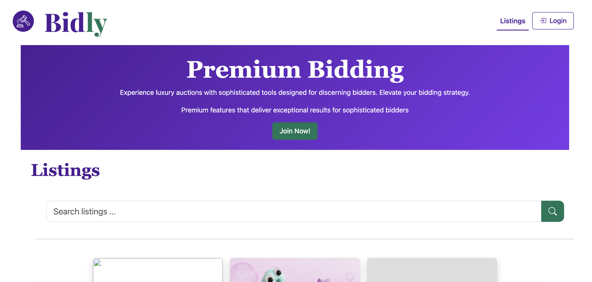
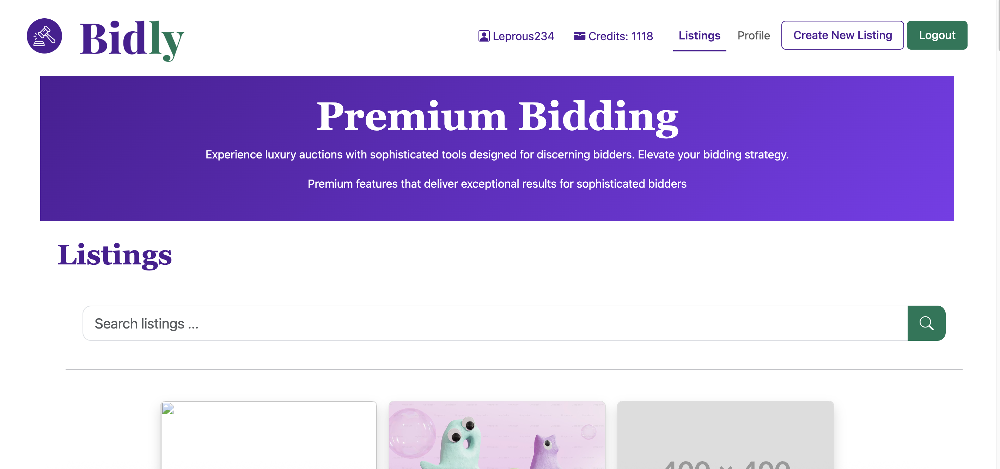
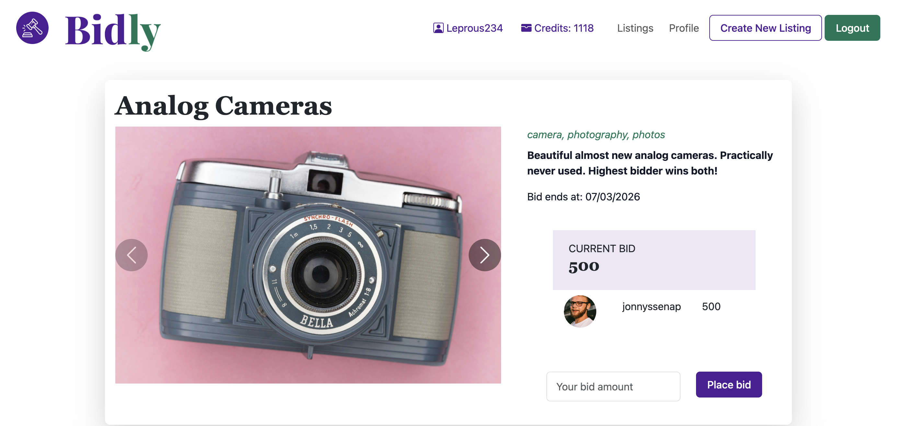
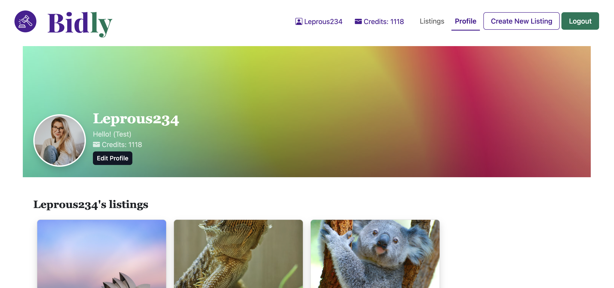

# Bidly Auction Site



## Intro

Bidly is a website where users can either browse auction listings as an unregistered user or they can create a user. If they choose to create a user, they will experience a website where they can auction off items, experiences or anything else they fancy! A user that is logged in will see how many credits they have[^1] and place bids on other peoples listings. A user can see their bid history on their profile page. On the profile page they can also see their own listings, and if they have won any auctions, it will be displayed here.

[^1]: All new users get 1000 credits when they register a user account.

Bidly Auction Site is my semester project 2 as part of my studies to become a front-end developer.

#### Live Demo:

[Bidly Auction Site][bidly-auction-site]

[//]: # 'Source definitions'
[bidly-auction-site]: https://bidly-auction-site.netlify.app/ 'Bitly Auction Site'

## Feature overview

- [x] User registration and authentication (1000 credits on signup)
- [x] Browse and search auction listings
- [x] Create, edit, and delete listings
- [x] Place bids on active auctions
- [x] View profile with bid history and won auctions
- [x] Responsive design for all devices

## Contents

- [Getting started](#getting-started)
  - [Requirements](#requirements)
  - [Install](#install)
  - [Usage](#usage)
- [Images and Project Structure](#images-and-project-structure)
  - [Project Structure](#project-structure)
- [Contributing](#contributing)
  - [Used Technologies](#used-technologies)
  - [Testing](#testing)

## Getting Started

In order to run this project locally on you computer, you have to do the following steps.
It is easier than you think.

### Requirements

Make sure that you have the following installed on your computer:

- Node.js (version 18 or higher)
- npm or yarn
- Git

### Install

#### 1. Clone the repository:

Use git to clone this repository into your computer. Assuming using https, then run the following in your CLI:

```
git clone https://github.com/Kateve52911/bidly.git
```

#### 2. Install dependencies:

Navigate to the root directory of the repo and run the following to install all dependencies.

```
npm install
```

### Environment Variables

Create a `.env` file in the root directory, see the .env.example file for an example.

```bash
VITE_API_KEY=your_api_key_here
VITE_API_BASE_URL=https://v2.api.noroff.dev
```

**Note:** Never commit your `.env` file to version control.

### Usage

After installation, run the development server:

```bash
npm run dev
```

Open your browser and navigate to the local host address shown in the terminal.

**As a user you can:**

- Register for an account (receiving 1000 credits in the process)
- Browse and search for auction listings
- Create your own listings
- Bid on items
- View your profile and bid history

## Images and Project structure:

### Images

The index page when user is logged in:



Here you can see what a single listing looks like when the user is logged in:



Here you see the profile page for the user:



### Project structure:

```
bidly/
├── src/
│   └── app/
│       ├── api/                    # API integration
│       │   ├── auth/               # Authentication endpoints
│       │   ├── listings/           # Listing CRUD operations
│       │   ├── user/               # User/profile operations
│       │   ├── config/             # API configuration
│       │   └── types/              # TypeScript type definitions
│       ├── components/             # Reusable UI components
│       │   ├── errorHandling/      # Error display components
│       │   ├── forms/              # Form components
│       │   ├── listings/           # Listing display components
│       │   ├── navbar/             # Navigation bar
│       │   ├── profile/            # Profile components
│       │   └── serachAndFilter/    # Search & filter functionality
│       ├── pages/                  # Page-specific TypeScript
│       │   ├── index.ts            # Home page logic
│       │   ├── login.ts            # Login page logic
│       │   ├── register.ts         # Register page logic
│       │   ├── profile.ts          # Profile page logic
│       │   ├── new-listing.ts      # Create listing logic
│       │   └── singleListing.ts    # Single listing view logic
│       ├── ui/                     # UI rendering utilities
│       │   ├── auth/
│       │   └── events/
│       └── utils/                  # Helper functions
│           ├── helpers/            # General utilities
│           │   ├── card/
│           │   ├── delay/
│           │   ├── forms/
│           │   ├── heroSection/
│           │   ├── listings/
│           │   └── modal/
│           ├── storage/            # Local storage management
│           └── validation/         # Form validation
├── scss/                           # Styling
│   ├── custom-bootstrap.scss       # Bootstrap customization
│   └── styles.scss                 # Custom styles
├── assets/                         # Static assets
│   ├── favicon/
│   └── images/
├── tests/                          # Unit tests
│   └── e2e/
│   │   └── auth/
│   └── unit/
│       └── app/
│           ├── ui/
│           └── utils/
├── index.html                      # Home page
├── listing.html                    # Listing detail page
├── login.html                      # Login page
├── register.html                   # Register page
├── profile.html                    # Profile page
├── new-listing.html                # Create listing page
├── main.ts                         # Application entry point
├── vite.config.ts                  # Vite configuration
├── vitest.config.ts
├── tsconfig.json                   # TypeScript configuration
└── package.json
└── package-lock.json
└── env.examples
└── eslint.config.mjs
└── playwright.config.ts
├── prettierrc
├── .gitignore
```

## Contributing

To contribute to the project, simply install as detailed above, and then after finishing your changes, create a PR on GitHub.

### Used technologies

The tech stack for this project includes:

- Typescript
- Bootstrap
- Vite
- Vitest
- Husky
- ESLint
- PlayWright

### Testing

In this project, there are two kinds of tests: unit tests and end-to-end (e2e) tests. To run each of these respectively, run the following commands:

```
npm test
npx playwright test --headed
```

There are actually many ways to run the playwright (e2e) tests. For example:

```
npx playwright test tests/e2e/auth/login.spec.ts --headed  # run a single test
npx playwright test --last-failed  # run last failed tests
```
